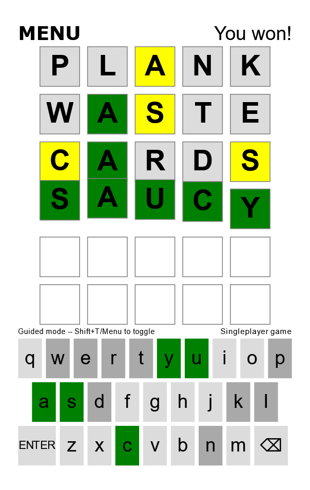

# WordleCoop
WebRTC Co-op Wordle Clone, written in TypeScript. 
Features a "guided mode," where you each character typed into the board is checked.
For example, guided mode won't let you put a yellow character in the same place again, it won't let you put any gray character down either.
## Images
